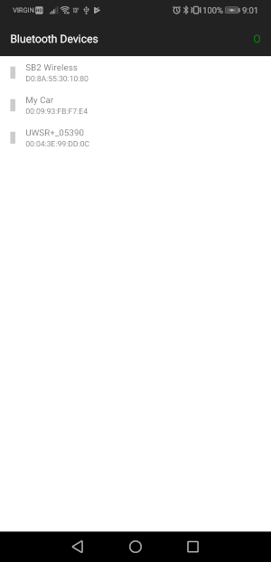
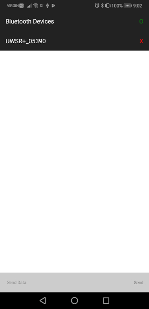
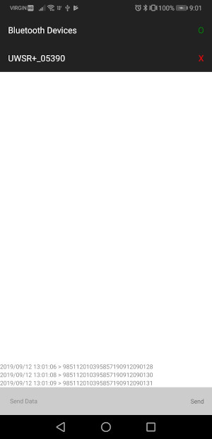

# BluetoothClassicExample

Bluetooth classic sample application - works as a serial reader/writer with Bluetooth classic devices.

## Setup

When attempting to setup and configure the local project, there are a couple possible issues that may be run into.  I've documented all the pain points I had while configuring the BluetoothClassicExample so that if they occur you will be able to resolve them and continue testing.

### Android 
The version of Android SDK which was created when using `react-native-library` and `react-native init` were different. 

1. Due to the way that `react-native-library` adds the peerDependencies (react-native) there are no versions downloaded for the Android project.  This means that when you're working on the project, it's using 0.20.0 (which is the latest version on Maven Central).  There are a few ways to get around this:
- Download the peer dependencies, there are a number of NPM modules for this
- Do development on the module within the BluetoothClassicExample project, since we know that it will have the correct version of React native. 

I decided to do the latter, If you've got a way around this or some best practices on how to develop modules in this way, please let me know and feel free to contribute the changes.

2. The second issue was that NPM 5+ performs symlinking of local projects, for that reason you'll see something that looks like this:
```
$ ls -l node_modules/react-native-bluetooth-classic
lrwxr-xr-x  1 user  group  5 13 Jun 12:46 node_modules/react-native-bluetooth-classic -> ../..
```

When installing locally you may run into issues with NPM > 5 where symlink are created.  After googling a bunch it seems like this is a pretty well known 'issue'.  Thanks to a posting [by a smarter person than I](https://github.com/facebook/metro/issues/1#issuecomment-501143843) this has been resolved by updating the `metro.config.js` file in the application project to the following:

```
let path = require('path');
module.exports = {
    transformer: {
        getTransformOptions: async () => ({
            transform: {
                experimentalImportSupport: false,
                inlineRequires: false
            }
        })
    },
    resolver: {
        /* This configuration allows you to build React-Native modules and
         * test them without having to publish the module. Any exports provided
         * by your source should be added to the "target" parameter. Any import
         * not matched by a key in target will have to be located in the embedded
         * app's node_modules directory.
         */
        extraNodeModules: new Proxy(
            /* The first argument to the Proxy constructor is passed as 
             * "target" to the "get" method below.
             * Put the names of the libraries included in your reusable
             * module as they would be imported when the module is actually used.
             */
            {
                'react-native-bluetooth-classic': path.resolve(__dirname, '../')
            },
            {
                get: (target, name) =>
                {
                    if (target.hasOwnProperty(name))
                    {
                        return target[name];
                    }
                    return path.join(process.cwd(), `node_modules/${name}`);
                }
            }
        )
    },
    projectRoot: path.resolve(__dirname),
    watchFolders: [
        path.resolve(__dirname, '../')
    ]
};
```

### IOS

IOS requires that UISupportedExternalAccessoryProtocols are configured within the Info.plist file.  As per the MFi these values should not be made available or stored within git unless working with the specific vendor.  The IOS build has been updated to include a merging of during the Run Scripts phase:

    Info.plist 
    ~/BluetoothClassicExample.plist

You're responsible for creating this file, without the file your plist will not be updated with supported protocols and the device will not be available within IOS.  You can forgo this and add the protocols directly to the development plist, but if pushed to git this goes against the terms of the Apple MFi program.  The following file can be copied to ~/BluetoothClassicExample.plist and then will be merged.  

```
<?xml version="1.0" encoding="UTF-8"?>
<!DOCTYPE plist PUBLIC "-//Apple//DTD PLIST 1.0//EN" "http://www.apple.com/DTDs/PropertyList-1.0.dtd">
<plist version="1.0">
<dict>
  <key>UISupportedExternalAccessoryProtocols</key>
  <array>
    <string>com.apple.m1</string>
  </array>
</dict>
</plist>
```

Willing to take suggestions on doing this in a better way: environment variables, etc. 

## Running Application

### Android

When running the application on a live device, make sure you use the `adb reverse tcp:8081 tcp:8081` command documented on the [React Native Docs](https://facebook.github.io/react-native/docs/running-on-device#method-1-using-adb-reverse-recommended).

#### Visual Studio Code
```
<Command Palette> React-Native: Run Android on Emulator
```

#### Android Studio

`run` or `debug` button

### IOS

In order to debug remotely (live device) the remote ip needs to be updated, as per the documentation for (React Native Debugging)[https://facebook.github.io/react-native/docs/debugging] do the following:

- On iOS devices, open the file RCTWebSocketExecutor.m and change "localhost" to the IP address of your computer, then select "Debug JS Remotely" from the Developer Menu.

or 

- Select "Dev Settings" from the Developer Menu, then update the "Debug server host for device" setting to match the IP address of your computer.
 
## Usage

The application contains two screens:

### Device List

Displays a list of devices currently connected.  Clicking on a device will bring you to the device connection screen where messages can be sent and received.  A terrible looking green `O` in the top-right shows that the Bluetooth is enabled.



### Device Connection

Displays a text area and text field allowing you to send and monitor communication.  Scanned data will be displayed on the screen with the timestamp.  Messages can be sent to the device by typing them in the text field and pressing SEND, responses will automatically be displayed.  Disconnect by pressing the equally terrible looking red `X` in the top-right to disconnect.



